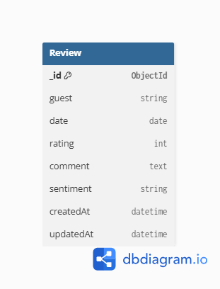

#  AI Guest Feedback Analyzer

[](https://ai-guest-feedback.vercel.app)
[](https://ai-guest-feedback.onrender.com)
[](https://openrouter.ai)

### AI Guest Feedback Analyzer is a full-stack web application that uses OpenRouter AI to analyze hotel guest reviews, identify sentiment and key themes, and generate professional management responses in real time.


##  Live Demo

> **Application:** [https://ai-guest-feedback.vercel.app](https://ai-guest-feedback.vercel.app)  

---
##  Key Features

-  **AI-Powered Review Analysis**
  - Detects review sentiment (Positive, Neutral, Negative)
  - Extracts key themes from guest feedback
  - Generates professional management responses using OpenRouter AI

-  **Review Management**
  - Add, edit, delete, and view guest reviews
  - Search and organize review records
  - Automatic sentiment tagging

-  **Batch AI Processing**
  - Analyze multiple pending reviews with a single click
  - Real-time loading state and error handling

-  **Secure Authentication**
  - JWT-based authentication
  - Google OAuth login
  - Protected routes for authorized users

-  **Dashboard**
  - Review statistics
  - Sentiment overview
  - Average ratings
  - Quick insights into guest feedback

-  **Full-Stack Deployment**
  - Frontend deployed on Vercel
  - Backend deployed on Render
  - MongoDB Atlas cloud database
---
##  Tech Stack

| Layer | Technology |
|-------|------------|
| **Frontend** | React.js, Vite, CSS3 |
| **Backend** | Node.js, Express.js |
| **Database** | MongoDB Atlas |
| **AI / LLM** | OpenRouter API (`openai/gpt-4o-mini`) |
| **Auth** | JWT, Passport.js, Google OAuth 2.0 |
| **Deployment** | Vercel, Render |
---
## How the AI Feature Works

1.  The user clicks **"Generate AI Responses"** on the Manage Reviews page.
2.  The frontend sends a `POST` request to `/api/ai/analyze` with the review text.
3.  The backend uses the **OpenRouter SDK** to send a structured prompt to the LLM.
4. The AI returns a structured JSON response:

```json
{
  "sentiment": "Negative",
  "keyPoints": "Clean room, rude staff, cold breakfast",
  "response": "Thank you for your feedback..."
}
```
This structured response is displayed in the application, allowing hotel managers to quickly understand guest feedback and generate professional responses.

---

## Database Choice

This project uses **MongoDB Atlas** because guest reviews are document-based and MongoDB provides a flexible schema, making it ideal for storing review data with varying content.

---

## Database Schema



---

## Review Schema

| Field | Type |
|-------|------|
| _id | ObjectId |
| guest | String |
| date | Date |
| rating | Number |
| comment | String |
| sentiment | String |
| createdAt | Date |
| updatedAt | Date |

---

## REST API Endpoints

| Method | Endpoint | Description |
|---------|----------|-------------|
| GET | /api/reviews | Get all reviews |
| GET | /api/reviews/:id | Get review by ID |
| GET | /api/reviews/stats | Get dashboard statistics |
| POST | /api/reviews | Create review |
| PUT | /api/reviews/:id | Update review |
| DELETE | /api/reviews/:id | Delete review |
| POST | /api/ai/analyze |	Analyze a review using AI |
| POST | /api/ai/generate-responses |	Generate AI responses for pending reviews |
---

## Project Structure

```
AI-Guest-Feedback/
├── backend/
│   ├── controllers/
│   ├── middleware/
│   ├── models/
│   ├── routes/
│   ├── services/
│   └── server.js
├── frontend/
│   ├── src/
│   │   ├── components/
│   │   ├── pages/
│   │   ├── styles/
│   │   └── App.jsx
│   └── public/
├── images/
├── PROMPTS.md
└── README.md
```
---

## Environment Variables

Create a `.env` file inside the `backend` folder.

```
PORT=5000

MONGO_URI=your_mongodb_connection_string

CLIENT_URL=http://localhost:5173

JWT_SECRET=your_secret_key

GOOGLE_CLIENT_ID=your_google_client_id

GOOGLE_CLIENT_SECRET=your_google_client_secret

OPENROUTER_API_KEY=your_open_router_key
```

---

## Installation

Clone the repository

```bash
git clone https://github.com/mnkshii/AI-Guest-Feedback.git
```

Install backend

```bash
cd backend
npm install
```

Run backend

```bash
npm start
```

Install frontend

```bash
cd ../frontend
npm install
npm run dev
```

---

## Deployment

| Service | Platform |
|----------|----------|
| Frontend | Vercel |
| Backend | Render |
| Database | MongoDB Atlas |
| AI Provider | OpenRouter |


---
## Future Enhancements

- Support multiple AI providers (Gemini, Claude, OpenAI)
- Export AI analysis reports as PDF
- Email notifications for high-priority negative reviews
- Advanced dashboard analytics with interactive charts
- Role-based access control (Admin/Manager)
- Multi-language review analysis
---

## Author

**Meenakshi Pandey**
